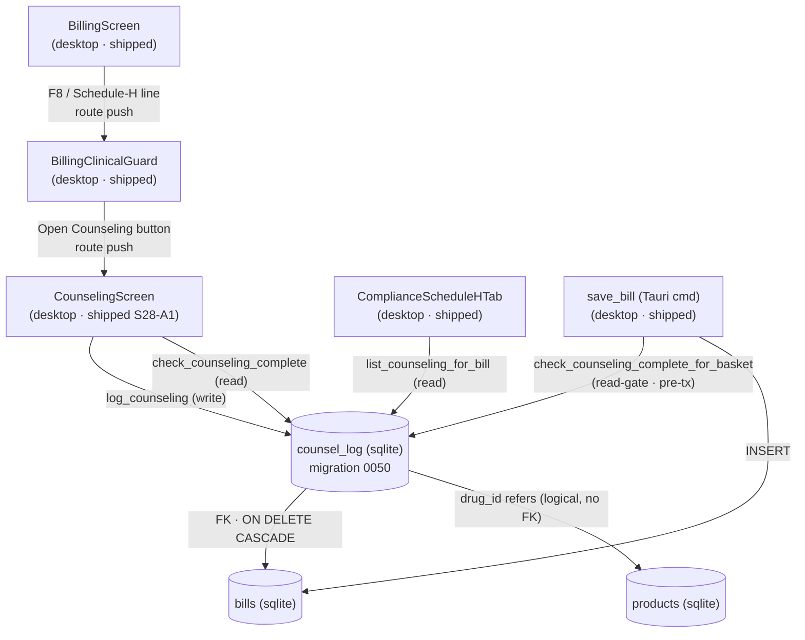
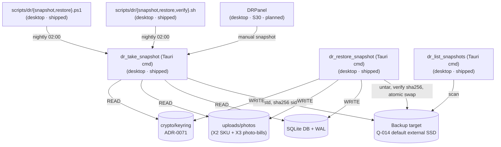
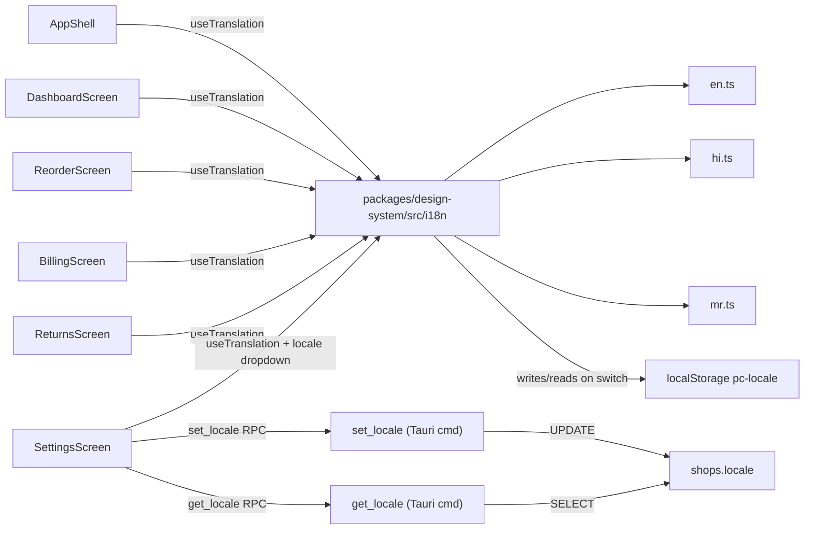
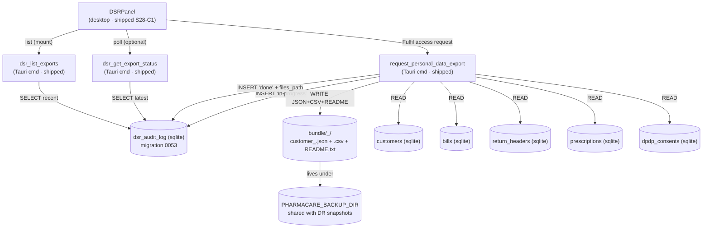

# PharmaCare Pro — Live Architecture Graph

> Source of truth for module / service / data-store / external-integration
> wiring. Per `08_rules/PROJECT_INSTRUCTIONS.md` §13 every PR that adds,
> renames, or removes a module MUST update this file + `system_graph.json`
> in the same change.

This file currently captures the subset of the v2.0 33-module catalogue
that the S28-A1 sprint touches. The full scaffold-out (all 33 modules,
all external integrations, all AI tiers) is on the FORWARD_PLAN v5
post-pilot deck — see `99_forward_plan/FORWARD_PLAN_v5_2026-05-08.md`
§7 (S29-S33).

## Counseling sub-graph (S28-A1)

### Nodes added in S28-A1

| id | layer | status | owner | notes |
|---|---|---|---|---|
| `counsel_log` | desktop / sqlite | shipped | A1 | Per-line counseling evidence (migration 0050) |

### Edges added in S28-A1

| from | to | protocol | payload | notes |
|---|---|---|---|---|
| `BillingScreen` | `CounselingScreen` | route push | `{ bill_id }` | Triggered by ClinicalGuard banner |
| `CounselingScreen` | `counsel_log` | sqlite write | `log_counseling` payload | Tauri command |
| `CounselingScreen` | `counsel_log` | sqlite read | `check_counseling_complete` payload | Tauri command |
| `save_bill` | `counsel_log` | sqlite read-gate | `(bill_id, product_ids)` | aborts on non-empty Vec<MissingCounsel> |
| `ComplianceScheduleHTab` | `counsel_log` | sqlite read | `list_counseling_for_bill` payload | Per-bill audit drill-down |

### Tests covering counsel_log edges

- Rust integration: `apps/desktop/src-tauri/tests/counseling_integration_test.rs`
  (10 tests covering migration, gate, log, list, cascade).
- Vitest: `apps/desktop/src/components/CounselingScreen.test.tsx`
  (4 tests covering empty-state, list, save dispatch, completion).
- Reuse: `BillingClinicalGuard.tsx` extended with `scheduleClass` prop +
  banner; covered by `BillingClinicalGuard.test.tsx` (existing 5 tests
  + new banner test pending Wave-2 integration).

## E2E coverage (S28-A2)

The Playwright harness under `apps/desktop/e2e/` covers 5 user-facing edge
classes. Edges below are tagged `[E2E]` if a runnable spec exercises them
end-to-end via the IPC stub at `apps/desktop/e2e/utils/ipc-stub.ts`, and
`[E2E:skip]` if a Tauri-only filesystem path stubs out behind a `test.skip`
TODO awaiting `tauri-driver` post-pilot.

| Spec | Edge under test | Status |
|---|---|---|
| `e2e/login.spec.ts` | bootstrap → AppShell render | `[E2E]` |
| `e2e/login.spec.ts` | password form → auth | `[E2E:skip]` (no `/login` route yet — S30+) |
| `e2e/save_bill.spec.ts` | BillingScreen → save_bill → bills | `[E2E]` |
| `e2e/grn.spec.ts` | GRNScreen → grn_save (manual line) | `[E2E]` |
| `e2e/grn.spec.ts` | GRNScreen → grn_csv_import (FS dialog) | `[E2E:skip]` (Tauri FS dialog) |
| `e2e/return.spec.ts` | ReturnsScreen → partial_refund | `[E2E]` |
| `e2e/gstr3b_export.spec.ts` | ReportsExportPanel → generate_gstr3b_payload | `[E2E]` |
| `e2e/gstr3b_export.spec.ts` | file-save dialog | `[E2E:skip]` (Tauri FS dialog) |

CI: `.github/workflows/e2e.yml` runs the harness on every PR (separate
workflow so Playwright runtime risk does not gate `ci.yml`'s typecheck +
cargo + migration jobs).

## DR sub-graph (S28-A6)

Targets: RTO ≤30min, RPO ≤5min. Retention: 14 nightly + 4 weekly + 12 monthly.

## Update log

- 2026-05-08 (S28 wave-1 A1): created SYSTEM_GRAPH.md + system_graph.json
  with counsel_log sub-graph.
- 2026-05-08 (S28 wave-1 A2): appended E2E coverage subsection.
- 2026-05-08 (S28 wave-1 A6): appended DR sub-graph.
- 2026-05-08 (lead integration): added `dr::dr_take_snapshot`,
  `dr::dr_restore_snapshot`, `dr::dr_list_snapshots` to main.rs handlers.

## i18n sub-graph (S28-B2)

Owner-language UI is consumed via `@pharmacare/design-system` i18n. Default
locale is `mr` (Marathi) per ADR-0074; fallback chain `mr -> hi -> en`.

### Nodes added in S28-B2

| id | layer | status | owner | notes |
|---|---|---|---|---|
| `i18n_module` | desktop / design-system | shipped | B2 | TS dictionaries, ~150 keys per locale |
| `shops.locale` | desktop / sqlite | shipped | B2 | migration 0051, `NOT NULL DEFAULT 'mr'` |

### Edges added in S28-B2

| from | to | protocol | payload | notes |
|---|---|---|---|---|
| `SettingsScreen` | `set_locale` | Tauri cmd | `{ shopId, locale }` | persists owner choice |
| `SettingsScreen` | `get_locale` | Tauri cmd | `{ shopId }` | reconcile on mount |
| `set_locale` | `shops.locale` | sqlite UPDATE | `locale` | migration 0051 |
| `get_locale` | `shops.locale` | sqlite SELECT | `locale` | migration 0051 |
| `i18n_module` | `localStorage[pc-locale]` | DOM | string | client cache |
| `*Screen` | `i18n_module` | `useTranslation()` | `t(key, vars)` | 5 screens migrated |

### Tests covering i18n edges

- `packages/design-system/src/i18n/__tests__/i18n.test.ts` — `t()`, fallback chain, setLocale round-trip, interpolation across en/hi/mr.
- `packages/design-system/src/i18n/__tests__/dicts_completeness.test.ts` — every en key mirrored in hi + mr; no extras; no empty values.
- `apps/desktop/src/components/SettingsScreen.locale.test.tsx` — dropdown change calls `set_locale` RPC; mount reconciles via `get_locale`.
- `apps/desktop/src-tauri/src/locale.rs` — unit tests for locale validation.
- 2026-05-08 (S28 wave-2 B2): added i18n sub-graph (locale switcher,
  dictionary fan-out, shops.locale persistence).
- 2026-05-08 (S28 wave-2 B1): visual NORTH_STAR sweep across 8 pilot-critical
  screens (BillingScreen, ReturnsScreen, ReorderScreen, DashboardScreen,
  SettingsScreen, GrnScreen, ComplianceDashboard, OnboardingWizard) against
  ADR-0029. Retired 23 inline hex literals in favor of `--pc-border-*` /
  `--pc-state-*` tokens; embedded `// NORTH_STAR §17` compliance markers at
  each screen file head listing the §17 18-box check (G/Y/R) for next
  quarterly drift review. No design-system primitives or tokens added; sister
  waves B2 (i18n) / B3 (validators) preserved 1:1. Detail in
  `docs/design/NORTH_STAR_SWEEP_S28-B1.md`.

## DSR auto-respond sub-graph (S28-C1)

Owner-driven DPDP §11 personal-data export. New `DSRPanel.tsx` triggers
`request_personal_data_export` which fans out reads across the customer's
PII-bearing tables, writes a JSON+CSV+README bundle to the DR backup root,
and records every transition in `dsr_audit_log` (migration 0053).

### Nodes added in S28-C1

| id | layer | status | owner | notes |
|---|---|---|---|---|
| `DSRPanel` | desktop / react | shipped | C1 | Owner UI; new-DSR form + recent-exports table |
| `dsr_audit_log` | desktop / sqlite | shipped | C1 | Append-only; CHECK on `kind` + `status` (migration 0053) |
| `dsr_export.rs` | desktop / rust | shipped | C1 | 3 Tauri cmds + pure helpers |
| `bundle/<dir>/` | desktop / fs | shipped | C1 | Lives under `PHARMACARE_BACKUP_DIR/dsr_exports/` |

### Edges added in S28-C1

| from | to | protocol | payload | notes |
|---|---|---|---|---|
| `DSRPanel` | `request_personal_data_export` | Tauri cmd | `{ customerId, requesterPhone, reason }` | One-click fulfil |
| `DSRPanel` | `dsr_list_exports` | Tauri cmd | `{ limit }` | Recent-exports table |
| `DSRPanel` | `dsr_get_export_status` | Tauri cmd | `{ requestId }` | Status polling |
| `request_personal_data_export` | `customers` | sqlite SELECT | `customer_id` | Read PII row |
| `request_personal_data_export` | `bills` | sqlite SELECT | `customer_id` | Read every bill |
| `request_personal_data_export` | `prescriptions` | sqlite SELECT | `customer_id` | Read Rx history |
| `request_personal_data_export` | `return_headers` | sqlite SELECT | join via bills | Read refunds |
| `request_personal_data_export` | `dpdp_consents` | sqlite SELECT | `customer_id` | Read consent ledger |
| `request_personal_data_export` | `bundle/<dir>/` | fs WRITE | JSON+CSV+README | 3 files per request |
| `request_personal_data_export` | `dsr_audit_log` | sqlite INSERT | 2 rows: in-progress + done | per request_id |
| `dsr_get_export_status` | `dsr_audit_log` | sqlite SELECT | `request_id` | Latest row |
| `dsr_list_exports` | `dsr_audit_log` | sqlite SELECT | `limit` | Most-recent N rows |

### Tests covering DSR edges

- Rust integration: `apps/desktop/src-tauri/tests/dsr_integration_test.rs`
  (7 tests covering migration, CHECK constraints, bundle 3-file write,
  JSON contents, request_id uniqueness, unknown-customer no-panic).
- Vitest: `apps/desktop/src/components/__tests__/DSRPanel.test.tsx`
  (5 tests covering header, list mount, new-DSR form, fulfil dispatch,
  empty-customer rejection).

- 2026-05-08 (S28 wave-2 C1): added DSR auto-respond sub-graph
  (DSRPanel + 3 Tauri cmds + dsr_audit_log + bundle filesystem layout).
